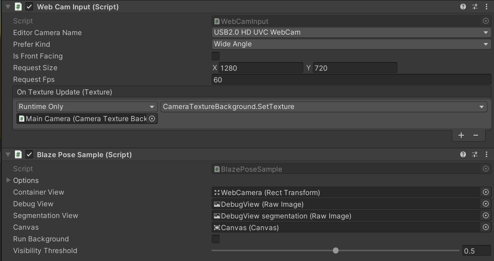
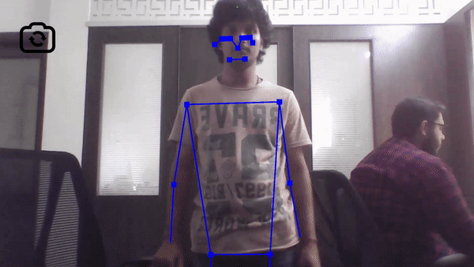

# DreamSoft Innovation Blaze Pose

Tested on  

- iOS / Android / macOS / Windows
- Unity 2020.3.29f1

sample :
BlazePose

## Install TensorFlow Lite for Unity

- If you want to try all examples, clone this repository with [Git-LFS](https://git-lfs.github.com/).
- If you just need TensorFlow Lite libraries via UPM, open the file `Packages/manifest.json` and add following lines into `scopedRegistries` and `dependencies` section.

```json
{
  "scopedRegistries": [
    {
      "name": "package.openupm.com",
      "url": "https://package.openupm.com",
      "scopes": [
        "com.cysharp.unitask"
      ]
    },
    {
      "name": "npm",
      "url": "https://registry.npmjs.com",
      "scopes": [
        "com.github.asus4"
      ]
    }
  ],
  "dependencies": {
    // Core TensorFlow Lite libraries
    "com.github.asus4.tflite": "2.9.1",
    // Utilities for TFLite
    "com.github.asus4.tflite.common": "2.9.1",
    // Utilities for MediaPipe
    "com.github.asus4.mediapipe": "2.9.1",
    ...// other dependencies
  }
}
```

## SET UP

_Blaze Pose_


_Video_
